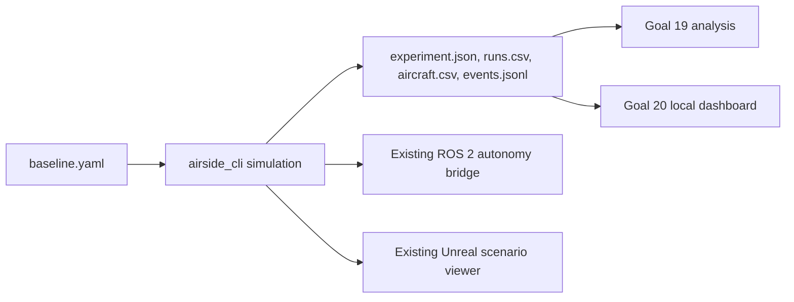

# Real RampLab experiment and dashboard workflow

This workflow runs the checked-in `baseline` airport-service simulation with seed 42, once with its scheduled road closure disabled (control) and once with the closure enabled (disruption). It uses the scenario's existing road-closure event; it does not add an airport system or synthesize taxi, runway, collision, or separation measures.

The Goal 21 starting point is the latest merged default branch after Goal 20 PR #3. That base contains Goals 19 and 20 and the Goal 17 mixed-runway work, but does not contain the Goal 18 scenario work referenced by the original acceptance brief. This workflow therefore uses only the scenarios and event types available in the merged base. In particular, this comparison demonstrates service/road-closure integration, not the absent Goal 18 IROPS/taxi/runway capabilities.

## Data flow



The ROS bridge and Unreal viewer are existing consumers of the simulation/autonomy APIs; the ROS package in this base is an autonomy tug bridge, not an aircraft-operation feed. Event replay in the dashboard is a timed record of emitted operational events and does not reconstruct physical positions or motion.

## Generate and analyze

From the repository root, build the CLI and generate four fresh single-run bundles (control, disruption, and one repeat of each):

```powershell
cmake -S . -B build -G Ninja -DCMAKE_BUILD_TYPE=Release
cmake --build build --target airside_cli
python tools/ops_dashboard/run_real_experiment.py --build-dir build --seed 42
```

Files are written beneath `results/goal21-real/` in `control/`, `disruption/`, `control-repeat/`, and `disruption-repeat/`. `analysis.md` and `analysis.json` contain the Goal 19 control/comparison results and repeat-run metric/event checks. Execution time and completion timestamp are observational metadata; normalized metrics and ordered event records are compared for determinism.

Each run bundle contains:

- `experiment.json` and `runs.csv` with one real simulator run and the run-level KPIs the current engine exports;
- `aircraft.csv` with the simulator's aircraft and completed service task state;
- `events.jsonl` copied from the simulator's ordered event history.

The bundle validator checks run identity and seed, aircraft totals/departures, per-aircraft service-task completion, closure event totals, event order, and required files. Run it on an individual bundle with:

```powershell
python tools/ops_dashboard/validate_real_bundle.py results/goal21-real/disruption
```

The simulator in this base does not export aircraft taxi/runway KPIs, collision counts, or minimum separation. Those values remain absent. Goal 19 and the dashboard must report safety as unknown when collision information is missing.

## Dashboard and replay

Start the local dashboard with the generated bundles configured:

```powershell
python tools/ops_dashboard/server.py --real-demo-dir results/goal21-real
```

Open `http://127.0.0.1:8765`, choose **Load real runs**, then inspect overview, KPI inventory, aircraft/tasks, disruptions, safety, replay, and analysis. Recorded `RoadClosed`, service, aircraft-state, and departure events appear in simulator order where emitted. Select **Check determinism** in Run analysis to compare the loaded real control/disruption output records. The generated side-by-side repeat evidence is also in `analysis.json`.

## Existing ROS and Unreal consumers

ROS build, live-topic, fault, and scenario probes are documented in [ros2.md](ros2.md); they exercise the current autonomy vehicle/control surface. The Unreal project and supported scenario launch paths are in [unreal-development.md](unreal-development.md). The dashboard bundles are portable experiment artifacts and are not an input format for the current ROS or Unreal consumers. Validate those surfaces against the checked-in scenario and compare only state they actually expose; do not treat autonomy vehicle output as aircraft taxi or runway evidence.
