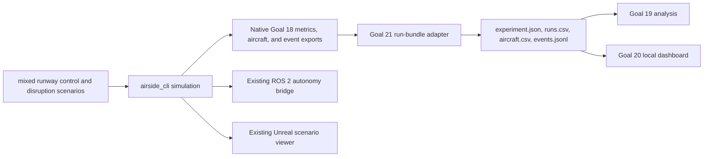

# Real RampLab experiment and dashboard workflow

This workflow uses Goal 18's matched `mixed_runway_operations.yaml` and `mixed_runway_disrupted.yaml` scenarios with seed 42. The disruption disables the A4 merge-to-gate taxi edge at simulation time 760 seconds. The selected scenarios include five aircraft (three turnarounds and two arrival-only flights), actual taxi/runway operations, service tasks, event histories, and safety metrics.

## Data flow



The ROS bridge exposes the current turnaround/autonomy data through its existing topics; the Unreal viewer consumes the operational simulation snapshots. Event replay in the dashboard is a timed record of emitted operational events and does not reconstruct physical positions or motion.

## Generate and analyze

From the repository root, build the CLI and generate four fresh single-run bundles (control, disruption, and one repeat of each):

```powershell
cmake -S . -B build -G Ninja -DCMAKE_BUILD_TYPE=Release
cmake --build build --target airside_cli
python tools/ops_dashboard/run_real_experiment.py --build-dir build --seed 42
```

Files are written beneath `results/goal21-real/` in `control/`, `disruption/`, `control-repeat/`, and `disruption-repeat/`. Each bundle preserves Goal 18's native metrics JSON/CSV and per-aircraft CSV, and adds a thin Goal 19/20 run projection plus the simulator's JSONL event stream. `analysis.md` and `analysis.json` contain the Goal 19 comparison and repeat-run metric/event checks. Normalized operational metrics and ordered event records are compared for determinism; wall-clock execution time is excluded.

Each run bundle contains:

- `experiment.json` and `runs.csv` with normalized run-level KPIs from Goal 18's native exports;
- `aircraft.csv` with aircraft surface state, taxi/runway measures, turnaround and task completion details;
- `events.jsonl` copied from the simulator's ordered event history;
- `simulator-metrics.json`, `simulator-metrics.csv`, and `simulator-metrics.aircraft.csv` preserved from the CLI.

The bundle validator checks run identity and seed, aircraft/departure totals, per-aircraft service task completion, taxi distance, collision totals, minimum aircraft separation, closure events, event order, and agreement with native Goal 18 exports. Run it on an individual bundle with:

```powershell
python tools/ops_dashboard/validate_real_bundle.py results/goal21-real/disruption
```

## Seed-42 acceptance observation

The matched scenarios each completed 3/3 turnarounds and 3/3 departures; the two arrival-only aircraft also reached their assigned gates. Both had zero aircraft-aircraft and aircraft-ground collisions, with 18.6016 m minimum aircraft spacing and 80.0269 m minimum aircraft-ground spacing. Fleet vehicles recorded zero collisions and 22.1815 m minimum separation. Goal 19 reported no safety regression.

The disrupted run emitted one `RoadClosed` event at 760 simulated seconds. Total aircraft taxi distance/time increased from 998 m / 1,946 s to 1,295 m / 2,243 s; the increase was on arrivals (326 m / 326 s to 623 m / 623 s). Departure delay, turnaround completion, departure taxi, and runway wait totals were unchanged. The simulator did not emit an aircraft reroute event for this path change; the workflow reports the native reroute count of zero and surfaces the changed taxi totals without inventing a reroute record.

Both selected runs export aircraft and ground collision counts, plus minimum aircraft, aircraft-ground, and fleet separation. Goal 19 compares those real values and reports unknown whenever the relevant source fields are absent. The runner fails acceptance if the chosen disruption creates a collision/safety regression.

## Dashboard and replay

Start the local dashboard with the generated bundles configured:

```powershell
python tools/ops_dashboard/server.py --real-demo-dir results/goal21-real
```

Open `http://127.0.0.1:8765`, choose **Load real runs**, then inspect overview, KPI inventory, aircraft/tasks, disruptions, safety, replay, and analysis. Recorded `RoadClosed`, service, aircraft-state, and departure events appear in simulator order where emitted. Select **Check determinism** in Run analysis to compare the loaded real control/disruption output records. The generated side-by-side repeat evidence is also in `analysis.json`.

## Existing ROS and Unreal consumers

ROS build, live-topic, turnaround, fault, and scenario probes are documented in [ros2.md](ros2.md). The Unreal project and supported scenario launch paths are in [unreal-development.md](unreal-development.md). The dashboard bundles are portable experiment artifacts and are not an input format for the current ROS or Unreal consumers. Validate each surface against the same checked-in scenario and compare only state each surface actually exposes.
