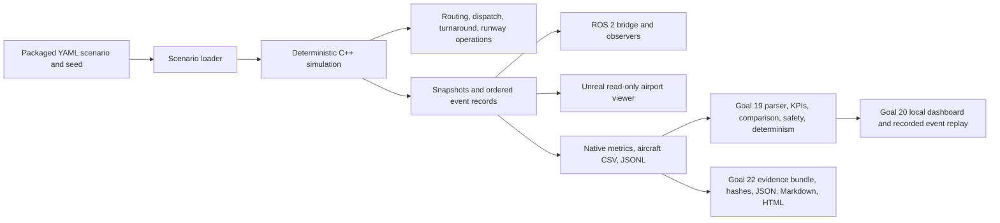

# RampLab airport operations release candidate

RampLab is a locally runnable, deterministic airport operations simulation with a visible Unreal viewer, an operator analysis dashboard, recorded event replay, and portable evidence reports. Its simulated airport geometry, operating rules, and KPIs are synthetic; this is an AutoVerse-style product proof, not a calibrated airport digital twin.

## One entry point

Requirements for the headless release path are Windows 11, Git, CMake 3.24+, Visual Studio with Desktop development with C++, and Python 3.10+. CMake downloads the pinned yaml-cpp and GoogleTest sources during the first configure, so initial setup needs network access. No Python packages, cloud services, credentials, or account are required.

From a Developer PowerShell for Visual Studio at the repository root, run:

```powershell
python tools/release/ramplab.py doctor
python tools/release/ramplab.py list
python tools/release/ramplab.py demo
```

`demo` configures and builds the C++ simulator, runs CTest and the Goal 19/20/22 Python suites, executes four real seed-42 simulation runs (taxiway-closure control, disruption, and one repeat of each), compares their exported results through Goal 19, and generates a Goal 22 bundle from the real control and disruption runs. Outputs use a new `results/goal23/YYYYMMDD-HHMMSS/` directory by default. The command fails on unsuccessful build, tests, simulation, safety regression, determinism mismatch, or evidence generation. For a faster rerun against an existing build, use `--skip-tests`.

Add `--unreal` to build and launch the visible windowed UE 5.8 taxiway-closure demonstration after evidence generation. Set `UE_EDITOR` to the UnrealEditor executable if it is installed outside the default location. Unreal and the optional Cesium geospatial background have separate prerequisites; a Cesium ion token stays in the ignored local `.env.local` and is not required for the synthetic operational overlay. Add `--dashboard` to start the loopback-only dashboard after the simulation; open `http://127.0.0.1:8765` and choose **Load real runs**. The evidence bundle's `index.html` is a static report that works offline.

Run an individual catalog scenario without the comparison/evidence packaging step:

```powershell
python tools/release/ramplab.py run --scenario vehicle-outage --mode disruption
python tools/release/ramplab.py run --scenario taxiway-closure --mode control
```

The curated library is in [scenario_catalog.json](../tools/release/scenario_catalog.json). It reuses the validated simulator configurations: `normal`, `vehicle-outage`, `taxiway-closure`, `turnaround-disruption`, and `flight-bank-contention`. The closure and vehicle outage entries accept `--mode control` to select their matched baseline configuration. Seed defaults to 42. Every run folder contains native simulator metrics JSON/CSV and the ordered event JSONL. No source edit is needed to choose a scenario.

## Golden demonstration

The canonical pair is `mixed_runway_operations.yaml` vs `mixed_runway_disrupted.yaml`, seed 42. The disruption closes the A4 merge-to-gate taxi link at 760 simulated seconds, so the affected arrival is routed over the available detour. The historical validated result was five aircraft, 3/3 turnarounds and departures, 2/2 arrival aircraft gated, five runway operations, zero collisions, and 18.6016 m minimum aircraft spacing. The affected arrival's taxi distance/time increased by 297 m/seconds (326 to 623) while operations completed. The release command writes fresh measurements and fails if safety or repeated-run comparisons fail; use those generated artifacts for current values.

Vehicle outage and task reassignment are available as the separate `vehicle-outage` scenario. Its previously validated seed-42 observation was 3/3 completed turnarounds and departures, all 18 service tasks completed, one reassignment, zero collisions, and 2.111018 m minimum fleet separation. This capability is demonstrated separately because the current outage configuration does not include the mixed arrival/departure surface-operation model; the release reports absent surface metrics as unavailable.

In Unreal, launch with `python tools/release/ramplab.py demo --skip-tests --unreal`. Watch the closure marker, alternate arrival taxi route, aircraft state, service vehicle assignments, turnaround tasks, runway queue, and completed operations. The visible editor mode runs the same checked-in mixed-runway closure scenario with its configured seed. Unreal mirrors the C++ simulation state and events; its panel does not load the dashboard bundle or serve as an independent source of operational truth.

The 2–3 minute reviewer walkthrough:

1. RampLab is a local deterministic airport ground-operations simulation. Run `python tools/release/ramplab.py demo` to build, validate, execute, compare, and package the scenario.
2. Open the generated Unreal window (or use the existing validated operator mode). Three aircraft and two service vehicles are active in the flight bank.
3. At 760 simulated seconds, the A4 taxi link closes. Observe the alternate route and the additional taxi distance/time for that arrival. The separate vehicle-outage scenario shows request requeue and reassignment.
4. Open `comparison/analysis.md` for the control/closure KPI comparison and repeat-run result. Start the dashboard with `--dashboard` to inspect aircraft/task rows, safety, disruption records, and the recorded JSONL event stepper. Run `vehicle-outage` separately to inspect service-request reassignment.
5. Open `evidence/index.html` for the portable final report. `evidence/timeline.json`, `determinism.json`, `manifest.json`, source copies, and SHA-256 records preserve inspectable evidence.

## System architecture



The core C++ simulation remains authoritative. ROS and Unreal consume its data. Goal 19 retains the analysis catalog and comparison semantics, Goal 20 reuses that module for the operator UI and event-log stepper, and Goal 22 packages copied simulator outputs and reports. Replay is a sequence of emitted event records; it does not invent motion or reconstruct positions.

## Release capability summary

The curated runs exercise deterministic discrete-event operations, arrivals/departures, turnaround task dependencies, autonomous ground service dispatch and reassignment, route closures and taxi routing, flight-bank contention, shared runway operation, safety sampling, ROS 2 integration, Unreal visualization, control/disruption analysis, recorded event replay, and evidence generation. The five catalog entries point to existing validated scenarios rather than adding new simulator behaviors.

## Validation surfaces

`demo` runs the full C++ CTest suite and the analysis, dashboard, and evidence Python suites. ROS validation requires the existing ROS 2 installation and workspace; use the build/test/probe commands in [ros2.md](ros2.md). Unreal requires UE 5.8 and a compatible MSVC toolset; build and visible runtime procedures are in [unreal-development.md](unreal-development.md). `--unreal` opens the actual window but does not capture screenshots or claim visual inspection. ROS and Unreal validation are reported separately from the headless demo results.

## Current limitations

- Scenario geometry, vehicle routes, schedules, task durations, and sampled separations are synthetic and are not calibrated to airport operations data.
- There are no live airport, airline, A-CDM, weather, surveillance, or historical operational feeds.
- The simulation uses simplified operational timing and event-to-event ground-vehicle movement rather than validated aircraft/vehicle physics.
- The service staffing, capacity, and disruption models are limited to the explicit scenario configuration.
- Unreal's operational layer uses lightweight procedural assets and planar synthetic geometry; it is not surveyed or terrain-conformed airport infrastructure.
- ROS 2 integration is local transport/observation and does not certify a production autonomy controller or connect to live vehicles.
- Minimum-separation and collision results apply only to the modeled scenario and the engine's sampling model. They are not real-airport safety certification.
- Event replay is a recorded timeline, not a motion replay engine.
